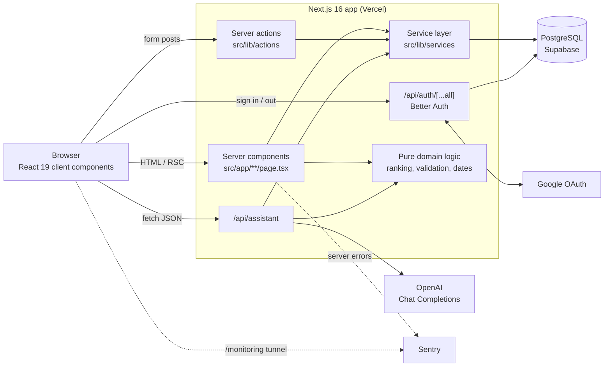

# Architecture

Mentra is a single Next.js 16 application. Pages, server actions, the assistant's API route and the authentication handler all run in the same app, which talks to one PostgreSQL database through Prisma. There is no separate backend service.

- [System overview](#system-overview)
- [Technology stack](#technology-stack)
- [Repository layout](#repository-layout)
- [Layers](#layers)
- [How a request flows](#how-a-request-flows)
- [Cross-cutting decisions](#cross-cutting-decisions)

## System overview



## Technology stack

| Concern | Choice | Where |
| --- | --- | --- |
| Framework | Next.js 16 (App Router, Turbopack), React 19, TypeScript (strict) | `src/app`, `next.config.ts`, `tsconfig.json` |
| Styling | Tailwind CSS v4, custom design tokens, `tw-animate-css` | `src/app/globals.css`, [DESIGN.md](../DESIGN.md) |
| UI primitives | shadcn/ui in the `base-nova` style, built on `@base-ui/react` | `src/components/ui`, `components.json` |
| Database | PostgreSQL (Supabase in production, `prisma dev` locally) | [database.md](database.md) |
| ORM | Prisma 7 with the `@prisma/adapter-pg` driver adapter | `prisma/`, `prisma.config.ts`, `src/lib/prisma.ts` |
| Authentication | Better Auth: email and password, optional Google | [authentication.md](authentication.md) |
| Validation | Zod 4 | `src/lib/*.ts` |
| Assistant | OpenAI Chat Completions with function tools, default model `gpt-5.6-terra` | [ASSISTANT.md](../ASSISTANT.md) |
| Error reporting | Sentry (`@sentry/nextjs`), with request data scrubbed | `src/instrumentation*.ts`, `src/lib/sentry-scrub.ts` |
| Theming | `next-themes` (light, dark, system) | `src/components/theme-*.tsx` |
| Tests | Vitest 4, integration tests against a real Postgres | [development.md](development.md#tests) |
| Hosting | Vercel | [deployment.md](deployment.md) |

## Repository layout

```text
.
├── prisma/
│   ├── schema.prisma          Data model
│   ├── migrations/            SQL migrations, applied on every build
│   └── seed-demo.ts           Fills one account with a demo term
├── src/
│   ├── app/                   Routes (App Router)
│   │   ├── page.tsx           Landing page (signed out)
│   │   ├── sign-in/ sign-up/ onboarding/
│   │   ├── dashboard/         "Today"
│   │   ├── courses/ tasks/ notes/ chats/ privacy/ profile/
│   │   ├── api/auth/[...all]/ Better Auth handler
│   │   ├── api/assistant/     Assistant endpoint
│   │   ├── layout.tsx         Fonts, theme, assistant panel
│   │   ├── error.tsx, global-error.tsx, not-found.tsx
│   │   └── globals.css        Design tokens and the Almanac styles
│   ├── components/            React components, grouped by feature
│   │   └── ui/                shadcn primitives
│   ├── lib/
│   │   ├── actions/           Server actions ("use server")
│   │   ├── services/          Database access, scoped to one student
│   │   ├── ai/                Assistant: tools, prompt, loop, OpenAI client
│   │   ├── auth.ts            Better Auth server configuration
│   │   ├── auth-client.ts     Better Auth browser client
│   │   ├── session.ts         getSession() and requireUserId()
│   │   ├── prisma.ts          Prisma client
│   │   └── *.ts               Pure logic: validation, ranking, dates, labels
│   ├── generated/prisma/      Generated Prisma client (gitignored)
│   ├── instrumentation.ts     Sentry, server side
│   └── instrumentation-client.ts  Sentry, browser side
├── docs/                      This documentation
├── ASSISTANT.md               What the assistant can and cannot do
├── DESIGN.md                  The design system
├── PRODUCT.md                 Product principles
└── plan.md                    Original product plan and roadmap
```

Other top-level folders (`.agents`, `.claude`, `.windsurf`, `.impeccable`, `.hallmark`, `.scratch`) hold AI agent skills, design-tool state and the original v0 tickets. None of them is needed to build or run the app; see [development.md](development.md#repository-extras).

## Layers

Code is split so that each layer only depends on the ones below it.

1. **Routes and components** (`src/app`, `src/components`). Pages are server components that read data through services and pure logic, then render. Interactive pieces (forms, rows, the sidebar, the assistant panel) are client components.
2. **Server actions** (`src/lib/actions`). Every mutation from a form goes through an action. Each action calls `requireUserId()`, parses the form with a zod schema, calls a service, and revalidates or redirects. Actions used with `useActionState` return a small state object such as `{ errors: string[] }`.
3. **The assistant route** (`src/app/api/assistant/route.ts` and `src/lib/ai`). It is a second entry point into the same services, driven by the model's tool calls instead of forms.
4. **Services** (`src/lib/services`). The only code that queries the database for application data. Every function takes the student's `userId` first and enforces ownership in the query itself. See [database.md](database.md#service-layer).
5. **Pure domain logic** (`src/lib/*.ts`). Validation schemas, the recommendation ranking, status and date rules, and labels. These modules have no database or framework dependencies. See [domain-logic.md](domain-logic.md).
6. **Data** (`prisma/`, `src/lib/prisma.ts`). The Prisma schema, migrations and client.

## How a request flows

### Reading a page

Opening `/dashboard`:

1. The root layout (`src/app/layout.tsx`) calls `getSession()`. For a signed-in student it also loads their most recent conversation, so the assistant panel is ready on every page.
2. The page calls `requireUserId()`, which redirects to `/sign-in` when there is no session.
3. It reads the student's clock with `getStudentTime()`, loads their work, courses and notes through services, and ranks the work with `rankTasks()`, using `?minutes=` if present.
4. It renders the term table, today's entry and the ranked list as server components. Nothing on the dashboard fetches data on the client.

### Changing something

Adding a piece of work from `/tasks`:

1. `CreateTaskForm` submits to `createTaskAction` through React's `useActionState`.
2. The action calls `requireUserId()`, then `parseTaskInput()`, which trims text, checks lengths and numbers, turns blanks into `undefined` and applies defaults.
3. `createTask()` checks that the chosen course belongs to the student, then inserts the row.
4. The action revalidates `/tasks`, `/dashboard` and `/notes`, and returns `{ errors: [] }`. The form resets and the page re-renders with the new row.

### Asking the assistant

Sending a message from the panel:

1. The client store in `src/lib/assistant-thread.ts` shows the message immediately and posts `{ message, conversationId }` to `/api/assistant`.
2. The route binds the student from the session, loads their memories and the thread's last 40 messages, and runs the tool loop against OpenAI. Every tool runs through the services with the session's `userId`.
3. The final reply and the student's message are stored, and `{ reply, conversationId }` is returned.

The full flow, the tools and the limits are in [ASSISTANT.md](../ASSISTANT.md).

## Cross-cutting decisions

- **Ownership is enforced in queries, not by trusting ids.** A service never loads a row by id alone; it filters on the student as well, so another student's row looks the same as a missing one. The assistant's tools never accept a `userId`.
- **Recommendations are deterministic.** The dashboard ranking and its "Recommended because..." sentence are ordinary code (`src/lib/recommendations.ts`), not a model's output. The assistant reads the same ranking through a tool, so it explains rather than decides.
- **Dates follow the student's calendar.** The browser reports its time zone in a cookie, and each request converts the current instant into the student's wall-clock time (`getStudentTime()`). "Today", "tomorrow", "overdue" and the greeting then compare whole calendar days, so a deadline doesn't flip to overdue part way through its due day, and the day changes at the student's midnight. See [domain-logic.md](domain-logic.md#dates-and-time-zones).
- **Row level security closes Supabase's public API.** All tables have RLS enabled with no policies. The app connects as the table owner and is unaffected. See [database.md](database.md#row-level-security).
- **Migrations run at build time.** `npm run build` applies migrations before `next build`, except on Vercel preview builds. See [deployment.md](deployment.md#migrations-during-the-build).
- **Privacy in error reports.** Sentry events have request bodies, cookies, headers and most query strings removed before sending. See [security.md](security.md#error-reporting).
- **Documentation has to stay in step with the assistant.** Any change under `src/lib/ai/` updates [ASSISTANT.md](../ASSISTANT.md) in the same commit, as required by [AGENTS.md](../AGENTS.md).
