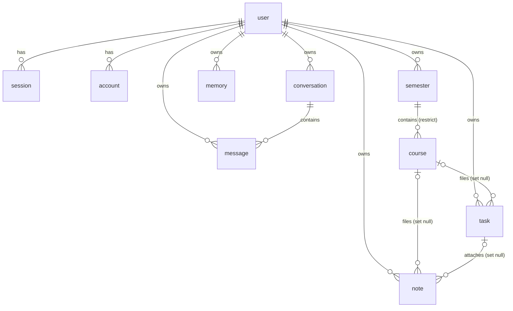

# Database and data layer

Mentra stores everything in PostgreSQL through Prisma 7. In production the database is Supabase; locally it is a Prisma dev server. This page covers the data model, the migration history, row level security, how the Prisma client is set up, and the service layer that every read and write goes through.

- [Data model](#data-model)
- [What happens on delete](#what-happens-on-delete)
- [Migrations](#migrations)
- [Row level security](#row-level-security)
- [Prisma client and connection strings](#prisma-client-and-connection-strings)
- [Service layer](#service-layer)
- [Demo seed script](#demo-seed-script)

## Data model

The schema lives in [`prisma/schema.prisma`](../prisma/schema.prisma). The generator is Prisma 7's `prisma-client` generator, which writes the client to `src/generated/prisma`; application code imports it from `@/generated/prisma/client`. The datasource block has no `url`, because the URL is supplied by [`prisma.config.ts`](../prisma.config.ts).

Every model maps to a lower-case table name with `@@map`. Ids default to `cuid()` except on the three Better Auth tables, where Better Auth generates the id. Every `updatedAt` column is maintained by Prisma, not by a database default.



### Enums

| Enum | Values |
| --- | --- |
| `TaskStatus` | `not_started`, `in_progress`, `paused`, `completed`, `cancelled` |
| `TaskPriority` | `low`, `medium`, `high` |
| `TaskType` | `task`, `assignment`, `exam` |
| `MemoryType` | `profile`, `commitment`, `learning_state`, `behavioral` |
| `MemorySource` | `explicit` (the student said it), `inferred` (the assistant concluded it) |
| `MessageRole` | `user`, `assistant` |

### `User` (table `user`)

A student. The same row is Better Auth's user record.

| Field | Type | Notes |
| --- | --- | --- |
| `id` | String | Primary key, cuid |
| `name` | String | Required; editable on the Profile page |
| `email` | String | Unique (`user_email_key`); not editable in the app |
| `emailVerified` | Boolean | Default `false` |
| `image` | String? | Avatar URL from Google, when signing in with Google |
| `program` | String? | Collected at onboarding; editable on Profile |
| `institution` | String? | Collected at onboarding; editable on Profile |
| `createdAt`, `updatedAt` | DateTime | |

### `Semester` (table `semester`)

A term: `name`, required `startDate` and `endDate`, and `userId` (cascade on user delete). Indexed on `userId`.

### `Course` (table `course`)

A course inside a semester: `name`, optional `code`, `professor` and `credits`. A course has **no `userId`**. It belongs to a student only through its semester, so every ownership check on a course filters on `semester.userId`. The foreign key to `semester` is `onDelete: Restrict`, so a semester that still has courses cannot be deleted.

### `Task` (table `task`)

A piece of work. The interface calls these "work".

| Field | Type | Notes |
| --- | --- | --- |
| `title` | String | Required |
| `description` | String? | |
| `dueDate` | DateTime? | Undated work is allowed |
| `priority` | TaskPriority | Default `medium` |
| `status` | TaskStatus | Default `not_started` |
| `type` | TaskType | Default `task` |
| `estimatedDuration` | Int? | Minutes |
| `actualDuration` | Int? | Minutes, recorded on completion |
| `topicsToReview` | String? | Mainly for exams |
| `courseId` | String? | Optional course; set to null if the course is deleted |
| `userId` | String | Owner; cascade on user delete |

Indexed on `userId` and `courseId`.

### `Note` (table `note`)

A student's own note: `title`, `body`, optional `courseId` and optional `taskId`. Both links are `onDelete: SetNull`, so a note outlives the course or work it was written for. Indexed on `userId`, `courseId` and `taskId`.

### `Memory` (table `memory`)

Something the assistant has learned about the student, carried into every assistant turn: `content`, `type` (`MemoryType`), `source` (`MemorySource`) and `createdAt`. Memories are never edited, only created and deleted, so there is no `updatedAt`. Indexed on `userId`.

### `Conversation` (table `conversation`)

One chat thread with the assistant. Threads exist because the assistant re-reads its own history every turn: if it once said something false, it keeps treating that as fact. Starting a new thread escapes the bad context without deleting the old one. `title` stays null until the first user message arrives, then takes the first 80 characters of it. Indexed on `(userId, updatedAt)`.

### `Message` (table `message`)

One line of a transcript: `role`, `content`, `conversationId` (cascade) and `userId` (cascade). `seq` is a database-wide `SERIAL` that gives a strict order. Two rows written in the same call can share a `createdAt` millisecond, so ordering always uses `seq`, which guarantees an answer never sorts above its question. Transcripts are kept separate from memories on purpose: losing a transcript loses a place in a conversation, while losing memory loses what the assistant has learned. Indexed on `(conversationId, seq)`, and on `(userId, createdAt)` for the assistant's hourly turn limit.

### Better Auth tables

These are owned by Better Auth's Prisma adapter. Do not write to them from application code.

- **`Session`** (`session`): `token` (unique), `expiresAt`, `ipAddress`, `userAgent`, `userId` (cascade).
- **`Account`** (`account`): one row per way of signing in. `providerId` is `credential` for email and password (the scrypt hash is in `password`) or a social provider id such as `google` (with OAuth tokens). Unique on `(issuer, accountId)`. For email and password accounts, `issuer` is `local:credential` and `accountId` is the user id.
- **`Verification`** (`verification`): short-lived verification values keyed by `identifier`. No foreign keys.
- **`RateLimit`** (`rate_limit`): Better Auth's rate-limit counters, one row per `key` (endpoint and IP) with `count` and `lastRequest` (milliseconds, `BigInt`). See [authentication.md](authentication.md#rate-limiting).

## What happens on delete

| Deleted row | Effect |
| --- | --- |
| User | Cascades to sessions, accounts, semesters, tasks, notes, memories, conversations and messages. The semester cascade is blocked while any course exists, so courses must be deleted first (see `deleteAccount`). |
| Semester | Refused by the database while it has courses. `deleteSemester` checks first and returns `has_courses`. |
| Course | Tasks and notes filed under it keep existing, with `courseId` set to null. |
| Task | Notes attached to it keep existing, with `taskId` set to null. |
| Conversation | Its messages are deleted. |

## Migrations

Migrations live in [`prisma/migrations/`](../prisma/migrations) and are applied in order. `npm run build` applies pending migrations before the app builds, on every build except Vercel previews (see [deployment.md](deployment.md#migrations-during-the-build)).

| Migration | Change |
| --- | --- |
| `20260825043520_init` | `user`, `session`, `account`, `verification`, with unique indexes on email, session token and `(issuer, accountId)` |
| `20260825215040_semester_course` | `semester` (cascade from user) and `course` (restrict to semester) |
| `20260826012607_task` | Task enums and the `task` table (course link set null) |
| `20260826013955_note` | `note` (course link set null) |
| `20260826022622_memory` | Memory enums and the `memory` table |
| `20260826212154_note_task_link` | Adds `note.taskId` (set null) |
| `20260827185110_message` | `MessageRole` and the `message` table, one log per student |
| `20260827191430_conversation` | Hand-edited data migration: adds `conversation`, backfills one conversation per student who already had messages (titled from their first message), points every message at it, then makes `message.conversationId` required |
| `20260913040000_enable_row_level_security` | Enables row level security on every table in `public` |
| `20260917030228_rate_limit` | `rate_limit` table for Better Auth's database-backed rate limiter, with RLS enabled |
| `20260917040000_message_user_created_index` | Index on `message(userId, createdAt)` for the assistant's turn limit |

Two consequences of the hand-edited conversation migration: backfilled conversations have UUID ids while newer ones have cuids, and a backfilled conversation whose student only had assistant messages has a null title. Both are harmless.

### Adding a migration

1. Edit `prisma/schema.prisma`.
2. Run `npx prisma migrate dev --name <change>` against your local database.
3. **If the migration creates a table**, add `ALTER TABLE "<table>" ENABLE ROW LEVEL SECURITY;` to the generated SQL. Prisma does not do this, and `src/lib/services/rls.test.ts` fails until you do.
4. Commit the schema and the migration folder together. The next deploy applies it.

## Row level security

Supabase exposes every table in the `public` schema through its Data API (PostgREST), reachable with the project's anon key, which is designed to be public. Without row level security, anyone holding that key could read and write every table, including password hashes and OAuth tokens in `account`, session tokens in `session`, and every student's notes and conversations.

The migration `20260913040000_enable_row_level_security` runs `ALTER TABLE ... ENABLE ROW LEVEL SECURITY` on all twelve tables that existed then, including `_prisma_migrations`; `rate_limit` enables it in its own migration. It creates **no policies**. With RLS on and no policies, Postgres returns no rows and allows no writes for any role that is not the table owner and lacks `BYPASSRLS`, which on Supabase includes `anon` and `authenticated`. The Data API is therefore closed.

Mentra itself is unaffected. It never uses PostgREST; every query goes through Prisma as the role that owns the tables, and owners bypass RLS unless `FORCE ROW LEVEL SECURITY` is set, which it is not.

Things to keep in mind:

- RLS is not a replacement for the service layer's ownership checks. Authorization happens in the services.
- If migrations were ever run as a different role from the one the app connects as, the app would see no rows until that role owns the tables or has `BYPASSRLS`.
- RLS does not cover `TRUNCATE`, and it does not revoke Supabase's default grants to `anon` and `authenticated`. The Data API cannot issue `TRUNCATE`, so that route is closed, but a direct Postgres login as those roles would still hold the grants.
- `rls.test.ts` checks that every ordinary table in `public` has RLS enabled in the **test** database. It proves the migrations turn RLS on; it does not inspect production.

## Prisma client and connection strings

[`src/lib/prisma.ts`](../src/lib/prisma.ts) creates one `PrismaClient` using the `@prisma/adapter-pg` driver adapter (node-postgres underneath):

- The pool reads `DATABASE_URL`, with `max: 1` connection in production and 10 elsewhere. On Vercel every serverless instance keeps a single connection and Supabase's pooler does the multiplexing.
- Outside production the client is cached on `globalThis`, so hot reload does not open new clients.

The runtime and the CLI use different connection strings:

| Variable | Used by | Supabase value |
| --- | --- | --- |
| `DATABASE_URL` | The running app (`src/lib/prisma.ts`) | Transaction pooler, port **6543** |
| `DIRECT_URL` | Prisma CLI and Migrate (`prisma.config.ts`) | Session pooler, port **5432** |

Prisma Migrate needs session-level advisory locks, which the transaction pooler does not support. `prisma.config.ts` uses `DIRECT_URL ?? DATABASE_URL`, so locally, where one URL serves both, `DIRECT_URL` can be left out. Leave it **unset** rather than empty: an empty string does not fall back.

## Service layer

All database access from pages, server actions and the assistant goes through the functions in [`src/lib/services/`](../src/lib/services). The rules they follow:

- **The caller supplies `userId` from the session.** Services trust it. Pages and actions get it from `requireUserId()`; the assistant route binds it once per request.
- **Ownership is enforced in the query.** Owned models filter on `userId`; courses filter on `semester: { userId }`. Updates and deletes use `updateMany` or `deleteMany` with `{ id, userId }` and treat a count of zero as `not_found`, so another student's row is indistinguishable from a missing one.
- **Linked ids are verified.** When a form or tool supplies a `courseId` or `taskId`, the service checks it belongs to the same student before writing.
- **Results are explicit.** Functions that can fail for expected reasons return `{ success: true, data }` or `{ success: false, error: "<code>" }`. Plain creates and lists return rows directly. Input types come from the zod schemas in `src/lib/*.ts`, which have already trimmed strings and checked lengths.
- **Updates distinguish "leave" from "clear".** In update types (`TaskUpdate`, `NoteUpdate`, `CourseUpdate`), `undefined` leaves a field as it is and `null` clears an optional one, which is how an edit form unfiles work from a course or empties a due date.
- **Races report, not throw.** If a row is deleted between a check and a write, the service returns the same `not_found` (or `course_not_found`, `has_courses`) the check would have, instead of letting a Prisma error escape.

| Service | Functions | Notes |
| --- | --- | --- |
| `semester.ts` | `createSemester`, `listSemestersForUser` (newest start first), `updateSemester`, `deleteSemester` | Delete returns `has_courses` while courses exist |
| `course.ts` | `createCourse`, `listCoursesForSemester`, `listCoursesForUser` (by name), `updateCourse`, `deleteCourse` | Create checks the semester belongs to the student |
| `task.ts` | `createTask`, `listTasksForUser` (newest first), `updateTask`, `completeTask`, `deleteTask` | Create and update check the course belongs to the student; new work always starts `not_started`; `completeTask` sets `completed` and optionally `actualDuration` |
| `note.ts` | `createNote`, `listNotesForUser`, `searchNotesForUser`, `updateNote`, `deleteNote` | Checks course and task links on create and update; search is a case-insensitive `contains` on title or body |
| `memory.ts` | `createMemory`, `listMemoriesForUser` (newest first), `listRecentMemoriesForUser`, `deleteMemory` | No update; the recent list returns a bounded page plus the total, for the assistant's prompt |
| `conversation.ts` | `createConversation`, `startConversation`, `listConversationsForUser`, `getConversationForUser`, `latestConversationForUser`, `deleteConversation` | The list hides threads with no messages; `startConversation` reuses an empty thread instead of creating another |
| `message.ts` | `appendMessages`, `listMessagesForConversation`, `countTurnsSince` | Appends in one transaction and titles the thread from its first user message; reads return the latest 40 (`MAX_STORED_HISTORY`), oldest first; `countTurnsSince` counts a student's recent messages for the turn limit |
| `profile.ts` | `getProfile`, `updateProfile`, `completeOnboarding` | Reports whether the student has a password and which social providers are linked; updates only name, program and institution |
| `account.ts` | `deleteAccount` | Deletes notes, tasks, memories, courses, semesters and the user in one transaction; courses go before semesters because of the restrict key |

## Demo seed script

[`prisma/seed-demo.ts`](../prisma/seed-demo.ts) fills an existing account with a realistic nursing term so the app can be evaluated with content in it:

```bash
npm run seed:demo -- --email you@example.com          # replace that account's data with the demo term
npm run seed:demo -- --email you@example.com --clear  # only remove that account's data
```

It creates one semester spanning today, five courses, eleven pieces of work (overdue, due today, upcoming, undated, one in progress and one completed), three notes and four memories. Dates are relative to the UTC day it runs. It writes through the same services the app uses, runs with `tsx`, and never creates an account; sign up first.

> **Warning:** every run first deletes the account's semesters, courses, work, notes and memories (in one transaction), with or without `--clear`, because seeding twice would otherwise duplicate everything. The script refuses to run unless `DATABASE_URL` points at `localhost`, `127.0.0.1` or `::1`; `--allow-remote` overrides that with a loud warning. Only seed a throwaway demo account.
