# User guide

What a student can do in Mentra, page by page. The screenshots use the demo term from `npm run seed:demo`.

- [Getting started](#getting-started)
- [Today](#today)
- [Courses](#courses)
- [Work](#work)
- [Notes](#notes)
- [Ask Mentra](#ask-mentra)
- [Chats](#chats)
- [What Mentra knows](#what-mentra-knows)
- [Profile](#profile)
- [Navigation, themes and phones](#navigation-themes-and-phones)

## Getting started

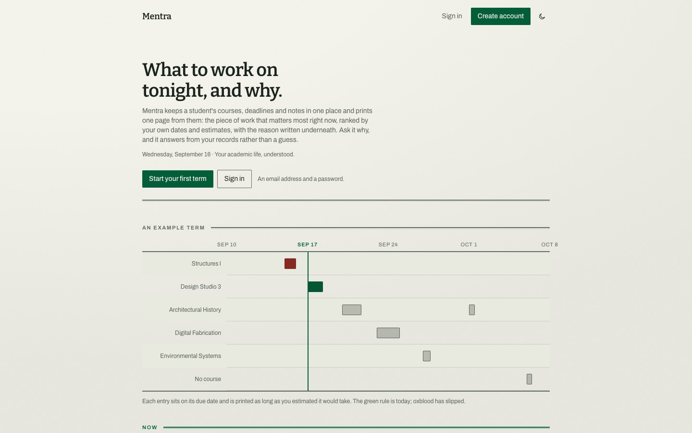

Signed-out visitors see the landing page. It explains what Mentra does with a live example term, the rules behind the ranking, what the assistant can and cannot do, and what Mentra stores. Signed-in visitors are sent straight to Today.

1. **Create an account** with a name, email and password (at least 8 characters), or with Google when it is configured.
2. **Say what you study.** A new account, whether made with email or Google, is asked for a program and institution. Both are optional, and you can skip the step.
3. **Add a term and its courses** on the Courses page.
4. **Add your work**: tasks, assignments and exams, with due dates and estimates.
5. **Open Today** to see what to work on first and why.

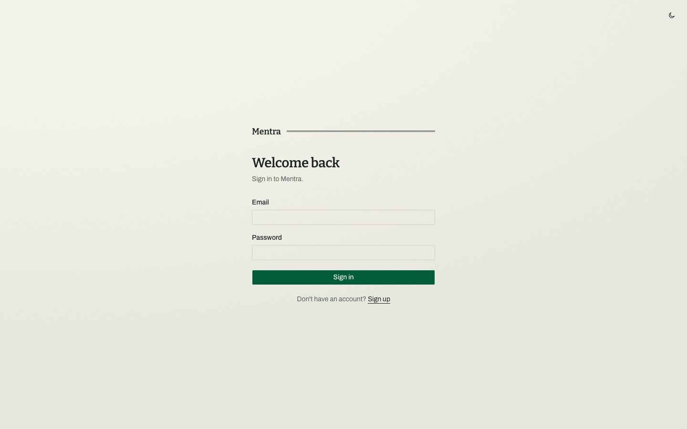

## Today

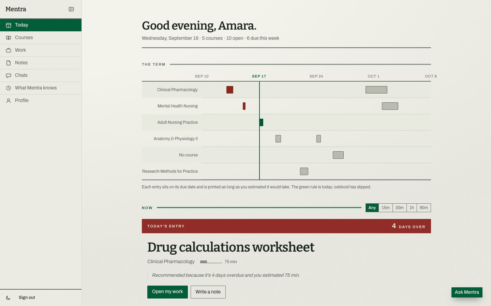

The dashboard, at `/dashboard`, is built from your own dates and estimates.

- **Heading.** A greeting with your name, today's date, how many courses you have, how much work is open, and how much is due within the week.
- **The term.** A timeline from a week ago to three weeks ahead with one row per course. Each piece of work sits on its due date, drawn as wide as you estimated it would take. The green line is today; oxblood marks work that has slipped. Hover or focus an item for its details. The timeline is hidden on phones.
- **Now.** Choose how much time you have (Any, 15m, 30m, 1h or 90m). Work that fits the time moves up; nothing is hidden.
- **Today's entry.** The single most important piece of work, with a countdown ("4 days over", "0 due today", "5 days left"), its course, estimate, and the reason it was chosen, such as "Recommended because it's 4 days overdue and you estimated 75 min." Buttons take you to your work or to write a note.
- **After that.** The next six pieces of work in order, with their due labels.

How the order is decided is described in [domain-logic.md](domain-logic.md#the-recommendation-engine). In short: overdue work first (most overdue first), then work due within three days, then later work, then undated work; within each group, work that fits your time, then higher priority, then the earlier date.

With no open work, Today offers buttons to add a course or add work.

A dark theme is available everywhere:

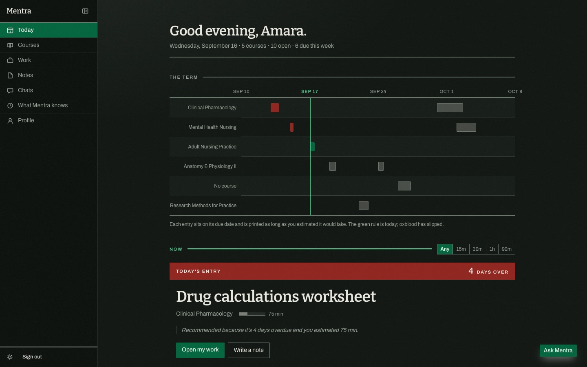

## Courses

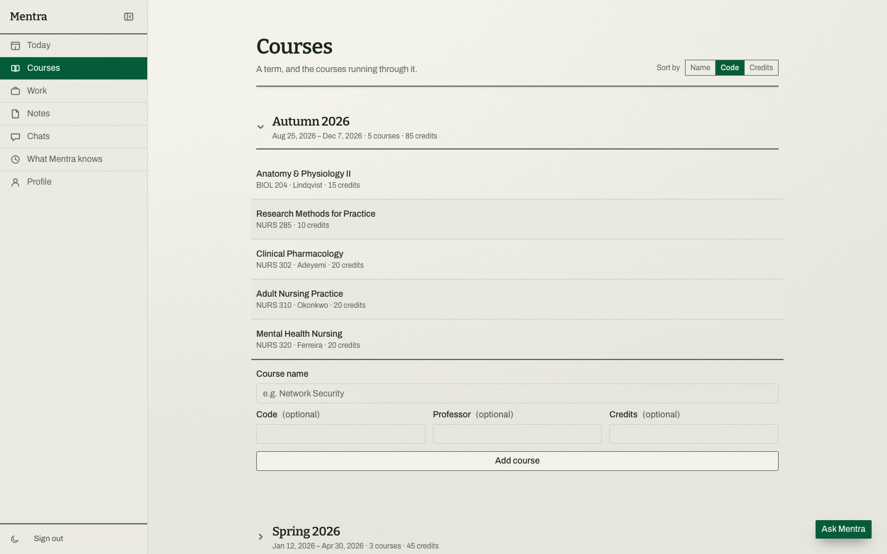

`/courses` holds your terms and the courses in them.

- **Add a term** with a name and start and end dates. The end must be after the start.
- **Add a course** to a term with a name and, optionally, a code, professor and credits.
- **Edit** a course in place, or **Remove** it after confirming. Work and notes filed under a removed course are kept, just no longer filed under it.
- **Delete a term** once it has no courses left. Terms cannot be renamed yet.

## Work

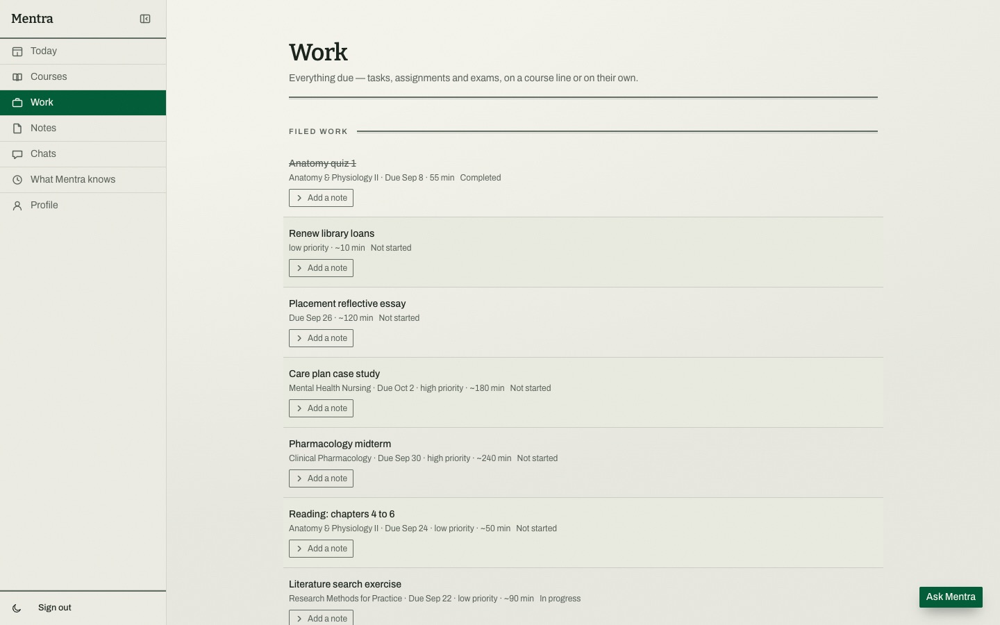

`/tasks` lists every piece of work, newest first, including completed (struck through) and cancelled work.

- **Add work** with a title, and optionally a description, course, type (task, assignment or exam), due date, priority, estimated minutes and topics to review.
- Each row shows its course, due date, priority (when not medium), estimate, and either its status or an **Overdue** marker. Overdue is worked out from the due date; you never set it.
- **Complete** marks open work as done. **Edit** changes any field, including the status (not started, in progress, paused, completed, cancelled) and how many minutes it actually took; emptying a field, such as the due date or choosing "No course", clears it. **Remove** asks "Remove for good?" before deleting; notes attached to it are kept.
- **Add a note** opens the notes attached to that piece of work and a quick form to add one.

## Notes

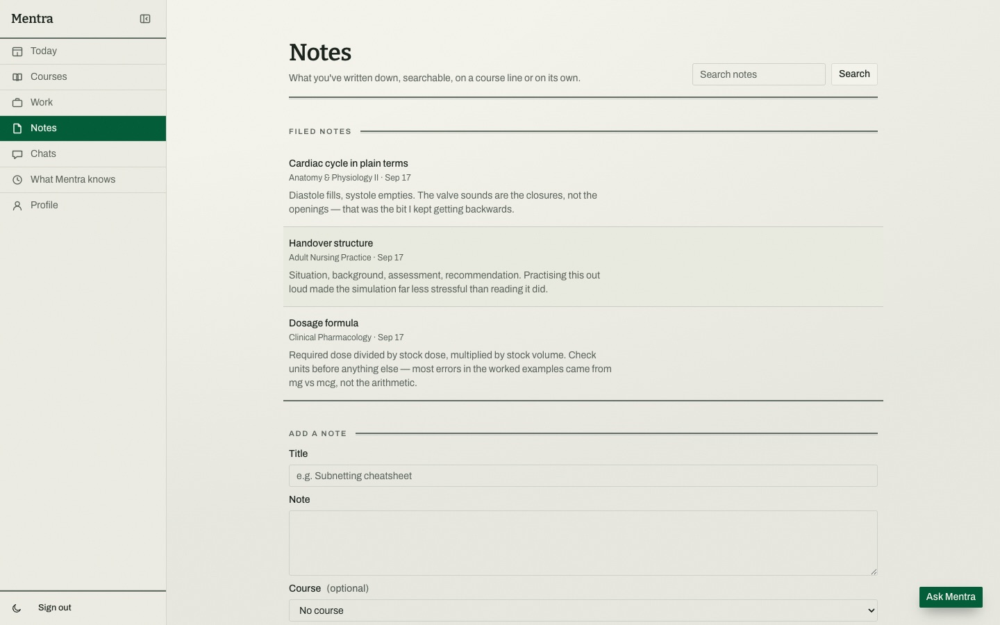

`/notes` holds everything you've written down.

- **Search** matches the title or body, ignoring case.
- **Add a note** with a title and body, optionally filed under a course and attached to an open piece of work.
- **Edit** or **Remove** (after confirming) a note from its row. A note stays attached to its piece of work even after that work is completed.

## Ask Mentra

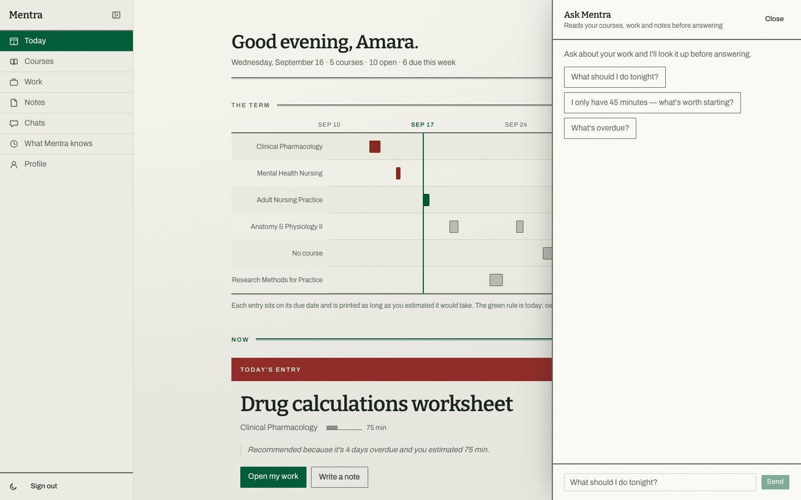

The **Ask Mentra** button in the corner of every signed-in page opens the assistant. It reads your courses, work, notes and what it has learned about you before answering, and it can file things for you:

- "What should I do tonight?" or "I only have 45 minutes" gets the same ranking as Today, with the reasons.
- You can ask up to 30 questions an hour.
- Mentioning work, a note or something about yourself in passing ("the lab report is due Friday") gets it filed, and the assistant says what it recorded.
- It can complete, change and delete work and notes, add terms and courses, and remember facts about you.
- It cannot delete a course, a term or a memory, change your profile or account, see grades, or read other students' data.

The exact list of abilities and limits is in [ASSISTANT.md](../ASSISTANT.md). The assistant needs `OPENAI_API_KEY` to be configured; without it, sending a message shows "The assistant isn't configured yet".

## Chats

Each conversation with the assistant is a separate thread, saved to your account.

- `/chats` lists your conversations, newest first, titled from their first question, with a message count.
- **New chat** starts a fresh thread. Use it if a conversation has gone wrong: the assistant re-reads the whole thread each time, so a mistake in an old thread keeps influencing it.
- Opening a chat shows the whole conversation and lets you continue it or **Delete** it permanently.

## What Mentra knows

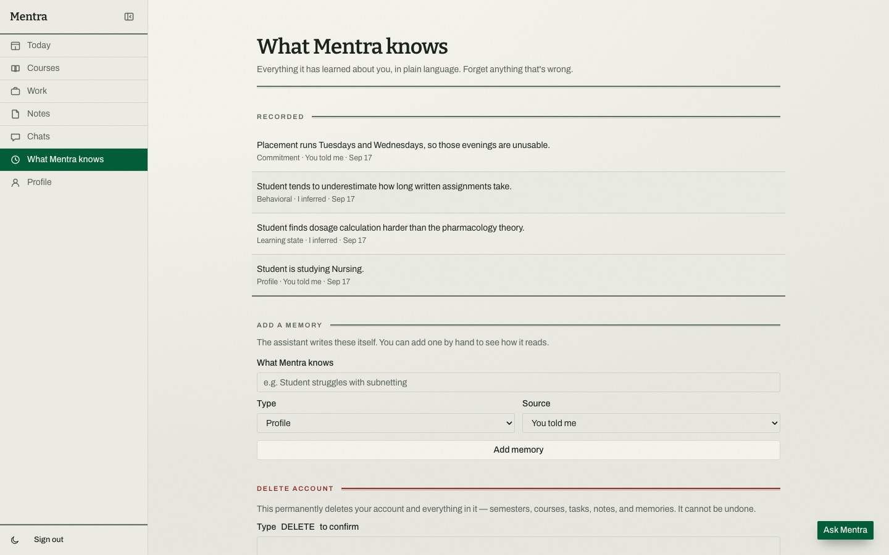

`/privacy` shows every memory the assistant has recorded about you, in plain language, with its kind (profile, commitment, learning state or behavioral), whether you told it or it inferred it, and when.

- **Forget** removes a memory once you confirm.
- **Add a memory** by hand to see how memories read.
- **Delete account** permanently removes your account and everything in it, including terms, courses, work, notes, memories and chats. Type `DELETE` to confirm.

## Profile

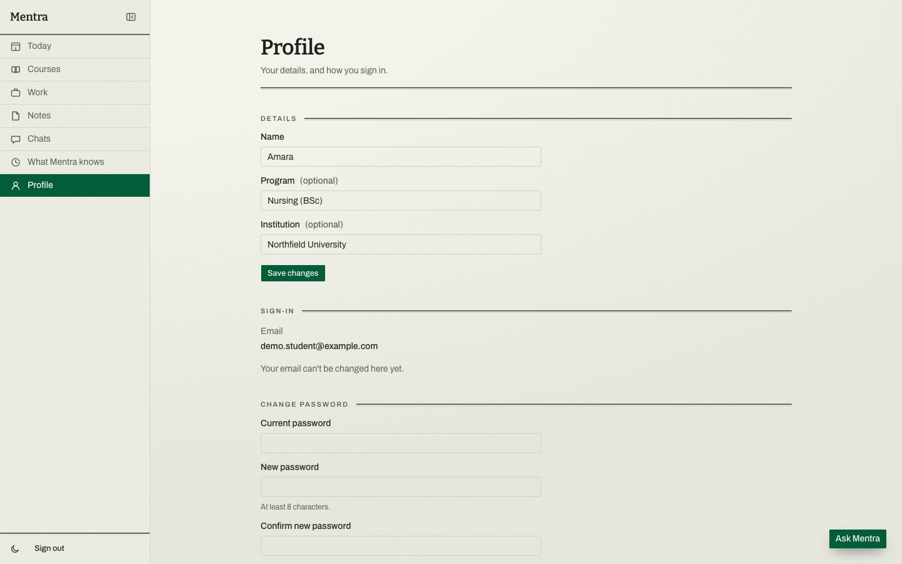

`/profile` holds your details and how you sign in.

- **Details:** change your name, program and institution. Clearing program or institution removes it.
- **Sign-in:** shows your email. It cannot be changed in the app yet. Google accounts are told their email comes from Google.
- **Change password** appears for accounts with a password. It needs your current password and a new one of at least 8 characters, entered twice. Changing it signs out your other devices; this one stays signed in.

## Navigation, themes and phones

- The sidebar links to Today, Courses, Work, Notes, Chats, What Mentra knows and Profile, with the theme switch and **Sign out** at the bottom. On larger screens it can be collapsed to icons, and the choice is remembered in the browser.
- The theme follows your system setting until you switch between light and dark.
- On phones the sidebar becomes a drawer opened from the top bar, and the term timeline is hidden.
- Dates follow your own time zone, taken from your browser, so "today" and "overdue" change at your midnight.

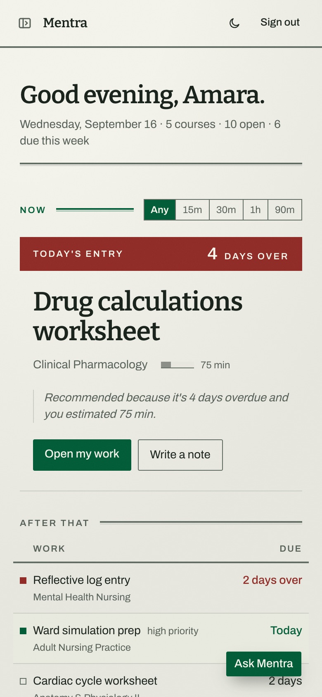
